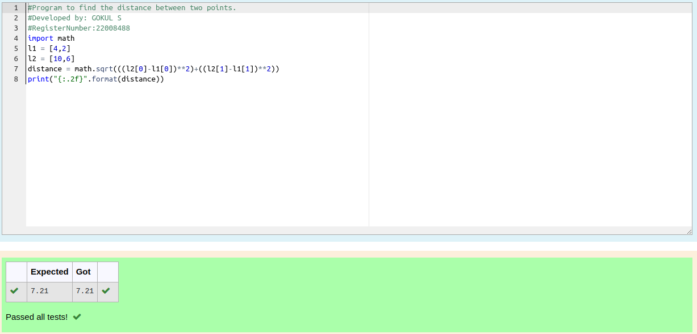

# DISTANCE-BETWEEN-TWO-POINTS

## AIM:
To write a python program to find the distance two 2 points
## ALGORITHM:
### Step 1: 
### Step 2: 
### Step 3: 
Substitute the values in the distance formula  
### Step 4: 
using the print function,display the distance between to points
### Step 5: 
End the program
### PROGRAM:
```
import math
l1 = [4,2]
l2 = [10,6]
distance = math.sqrt(((l2[0]-l1[0])**2)+((l2[1]-l1[1])**2))
print("{:.2f}".format(distance))
```
  


### OUTPUT:



### RESULT:
Thus the distance between the two points is sucessfully executed and displayed
